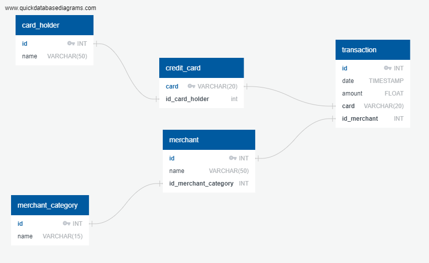

# Iendtifying Suspicous Activity Using SQL

Fraud is prevalent these days, whether you are a small taco shop or a large international business. While there are emerging technologies that employ machine learning and artificial intelligence to detect fraud, many instances of fraud detection still require strong data analytics to find abnormal charges.

I will apply SQL skills to analyze historical credit card transactions and consumption patterns in order to identify possible fraudulent transactions.

## I will accomplish four main tasks:

### Data Modeling

Create an entity relationship diagram (ERD) by inspecting the provided CSV files.

### Data Engineering

Using the database model as a blueprint, create a database schema for each of your tables and relationships. 

### Data Analysis

Analyze the data to identify possible fraudulent transactions.

.png)

.png)

.png)

### Data Challenge:

Use standard deviation and quartiles to detect outliers identifying fraudulent transactions.

Results found in motebook: [visual_data_analysis.ipynb](https://github.com/dtcosta/SQL-Suspicious-Activity/blob/master/Code/visual_data_analysis.ipynb)

